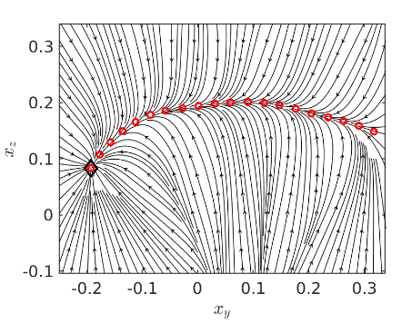
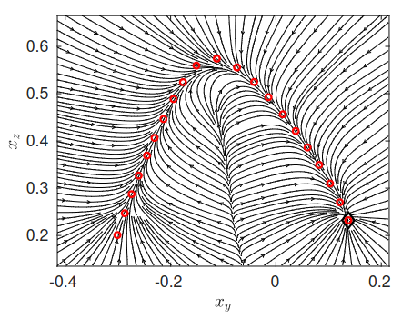

# VSDS

Copyright (C) 2023, by Youssef Michel.

### Description
The project provides the C++ implementation of the Variable Stiffness Dynamical System (VSDS) approach which aims to generate a force field
based on a first order DS and a desired stiffness profile in a closed loop configuration. The streamlines of the VSDS controller are illustrated below

<p float="left">
  
  
</p>

For more details, please check:

> [1] Y. Michel, M. Saveriano, and D. Lee, "A Passivity-Based Approach for Variable Stiffness Control With Dynamical Systems," IEEE Transactions on Automation Science and Engineering (TASE), 2023.

The main scripts in this project are:

- `VSDS_base.cpp`: contains the base class implementation of the VSDS algorithm for the translation case. The `/config` folder contains the parameters used by VSDS such as the via-points definition, initial and goal orientation.

- `VSDS_qp.cpp`, `VSDS_vf.cpp`, `VSDS_org.cpp` provide the implementation of the specfic VSDS approach chosen. For more details check the above paper
 to the robot. Override the implementation based on your speficic robot.

- `VSDS_main.cpp`: This scipt implements the main control loop of the VSDS control law, handling the communication with a Kuka Robot via FRI, recieving sensor
              readings and sending force commands to the robot


### Usage
- First, clone the project into your `/catkin_ws/src` and build using `catkin_make`
- To launch the package, use the `VSDS.launch`, while also specifying:
  - The DS type i.e. the shape of the motion. Use one of the shapes specified in `config`, or provide your custom DS
  - The VS type, this can be `qp` (the QP approach), `fd` (the velocity feedback approach) or `org` (the original formulation). Please check the paper for more details
  -   The stiffness: can be either `v` for variable or `c` for constant.
- For example, we can use the following command to launch:  
```
roslaunch VSDS VSDS.launch VSDS_name:=Trapezoid_DS VS_type:=qp Stiff_type:=v
```


